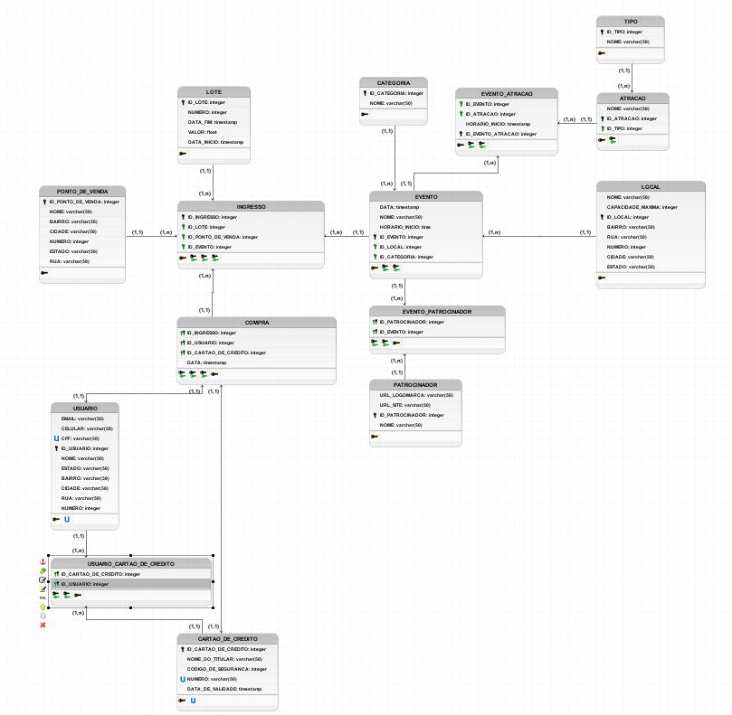

# LUNI — Plataforma de Gestão de Ingressos

Trabalho da disciplina de **Banco de Dados I (DEC7129)** — **Universidade Federal de Santa Catarina, campus Araranguá**.

Professor: **Dr. Alexandre Leopoldo Gonçalves**

Autores: **Lucas Porto** e **Nikolas Lopes**

Semestre **2024/1**

---

## 📌 Sobre o projeto

O LUNI é um sistema de banco de dados para uma plataforma de venda de ingressos. O objetivo geral é oferecer uma estrutura onde usuários possam explorar e adquirir ingressos para uma ampla variedade de eventos, visualizando informações detalhadas sobre cada um deles.

O projeto foi desenvolvido em **Python**, utilizando o conector `mysql-connector-python` para se comunicar com um banco de dados **MySQL**, e cobre todo o ciclo de vida do banco: criação das tabelas (DDL), inserção de dados de teste, operações de atualização e exclusão, e consultas.

## ⚙️ Funcionalidades / Regras de negócio

- **Usuários**: cada usuário possui e-mail, nome, CPF (único), celular e endereço completo (estado, bairro, cidade, rua, número).
- **Compra de ingressos**: pode ser feita pelo site ou em um ponto de venda físico (loja parceira), com endereço próprio cadastrado.
- **Eventos e categorias**: cada evento tem nome, data, horário de início e pertence a uma categoria (Show, Teatro, Stand-up Comedy, Palestra, Concerto).
- **Atrações**: um evento pode ter várias atrações (cantor, banda, músico, palestrante, etc.), classificadas por tipo, e uma mesma atração pode participar de vários eventos.
- **Lotes**: os ingressos são vendidos por lote, com data de início/fim e valor. Quanto maior o número do lote, mais caro é o ingresso.
- **Local do evento**: cada evento acontece em um local (com capacidade máxima), e um local pode sediar vários eventos.
- **Patrocinadores**: eventos podem ter diversos patrocinadores (com logomarca e site), e um patrocinador pode patrocinar vários eventos.
- **Cartão de crédito**: cada usuário pode ter mais de um cartão cadastrado, usado no momento da compra do ingresso.

## 🗃️ Modelagem do banco de dados

### Modelo Conceitual

<p align="center">
  
</p>

### Modelo Lógico

<p align="center">
  
</p>

### Entidades do banco

O script `main.py` cria as seguintes tabelas:

| Tabela | Descrição |
|---|---|
| `USUARIO` | Dados dos usuários da plataforma |
| `CARTAO_DE_CREDITO` | Cartões de crédito cadastrados |
| `USUARIO_CARTAO_DE_CREDITO` | Associação N:N entre usuários e cartões |
| `PONTO_DE_VENDA` | Lojas parceiras físicas que vendem ingressos |
| `LOCAL` | Locais onde os eventos acontecem |
| `CATEGORIA` | Categoria do evento (Show, Teatro, etc.) |
| `TIPO` | Tipo de atração (Cantor, Banda, Palestrante, etc.) |
| `ATRACAO` | Atrações que participam de eventos |
| `EVENTO` | Eventos cadastrados |
| `EVENTO_ATRACAO` | Associação N:N entre eventos e atrações |
| `PATROCINADOR` | Patrocinadores dos eventos |
| `EVENTO_PATROCINADOR` | Associação N:N entre eventos e patrocinadores |
| `LOTE` | Lotes de venda de ingressos (com valor e período) |
| `INGRESSO` | Ingressos disponíveis, ligados a evento, lote e ponto de venda |
| `COMPRA` | Registro de compra de um ingresso por um usuário com um cartão |

Todas as tabelas possuem chaves estrangeiras para garantir a integridade referencial entre as entidades relacionadas.

## 🛠️ Tecnologias utilizadas

- **Python 3**
- **MySQL** (banco de dados relacional)
- **mysql-connector-python** (biblioteca de conexão Python ↔ MySQL)

## ▶️ Como executar

### Pré-requisitos

- Python 3 instalado
- Um servidor MySQL rodando localmente
- Biblioteca `mysql-connector-python`:

```bash
pip install mysql-connector-python
```

### Configuração

No arquivo `main.py`, a função `connect_resgatocao()` define os parâmetros de conexão com o banco:

```python
def connect_resgatocao():
    cnx = mysql.connector.connect(host='localhost', database='modelo', user='root', password='123')
```

Antes de rodar, crie o banco de dados vazio (schema) no MySQL com o mesmo nome usado em `database=` (por padrão, `modelo`):

```sql
CREATE DATABASE modelo;
```

Ajuste `host`, `database`, `user` e `password` de acordo com o seu ambiente, caso necessário.

### Executando

Com o banco de dados criado e o MySQL em execução, rode o script:

```bash
python main.py
```

O programa exibirá um menu interativo no terminal:

```
---MENU---
1.  CRUD RESGATOCAO
2.  TEST - Create all tables
3.  TEST - Insert all values
4.  TEST - Update
5.  TEST - Delete
6.  CONSULTA 01
7.  CONSULTA 02
8.  CONSULTA 03
9.  CONSULTA EXTRA
10. Show Table
11. Update Value
12. CLEAR ALL RESGATOCAO
0.  Disconnect DB
```

**O que cada opção faz:**

| Opção | Ação |
|---|---|
| 1 | Executa o fluxo completo: apaga as tabelas, recria todas, insere os dados de teste, roda as 4 consultas ("antes"), executa updates e deletes de teste, e roda as 4 consultas novamente ("depois") — útil para ver o CRUD completo de ponta a ponta |
| 2 | Cria todas as tabelas do banco (DDL) |
| 3 | Insere os dados de teste em todas as tabelas |
| 4 | Executa updates de teste em algumas tabelas |
| 5 | Executa deletes de teste em algumas tabelas |
| 6 | Roda a Consulta 1 |
| 7 | Roda a Consulta 2 |
| 8 | Roda a Consulta 3 |
| 9 | Roda a Consulta Extra |
| 10 | Permite escolher uma tabela pelo nome e exibir todos os seus registros |
| 11 | Permite atualizar manualmente um valor em qualquer tabela, informando atributo, novo valor e a chave primária do registro |
| 12 | Apaga (drop) todas as tabelas do banco |
| 0 | Encerra a conexão com o banco e finaliza o programa |

## 🔎 Consultas

### Consulta 1 — Valor total arrecadado por evento

Exibe o valor total arrecadado com a venda de ingressos, agrupado por evento.

```sql
SELECT
        EVENTO.id_evento,
        EVENTO.nome,
        sum(valor)
FROM
        EVENTO,
        INGRESSO,
        LOTE,
        COMPRA
WHERE
        EVENTO.id_evento = INGRESSO.id_evento AND
        INGRESSO.id_ingresso = COMPRA.id_ingresso AND
        INGRESSO.id_lote = LOTE.id_lote
GROUP BY
        EVENTO.id_evento
ORDER BY
        EVENTO.id_evento;
```
<p align="center">
  
</p>

### Consulta 2 — Número de atrações por evento

Mostra quantas atrações estão associadas a cada evento.

```sql
SELECT
    EVENTO.id_evento,
    EVENTO.nome,
    count(*)
FROM
    EVENTO,
    EVENTO_ATRACAO,
    ATRACAO
WHERE
    EVENTO.id_evento = EVENTO_ATRACAO.id_evento AND
    ATRACAO.id_atracao = EVENTO_ATRACAO.id_atracao
GROUP BY
    EVENTO.id_evento
ORDER BY
    EVENTO.id_evento;
```

<p align="center">
  
</p>

### Consulta 3 — Ingressos restantes até a lotação máxima

Exibe a quantidade de ingressos que ainda podem ser vendidos até atingir a capacidade máxima do local de cada evento.

```sql
SELECT
    EVENTO.id_evento,
    EVENTO.nome,
    LOCAL.capacidade_maxima - count(*)
FROM
    EVENTO,
    INGRESSO,
    COMPRA,
    LOCAL
WHERE
    EVENTO.id_evento = INGRESSO.id_evento AND
    INGRESSO.id_ingresso = COMPRA.id_ingresso AND
    EVENTO.id_local = LOCAL.id_local
GROUP BY
    EVENTO.id_evento, EVENTO.nome
ORDER BY
    EVENTO.id_evento;
```

<p align="center">
  
</p>

### Consulta Extra — Ranking de compras por usuário

Consulta adicional que mostra o ranking de usuários por quantidade de compras realizadas.

```sql
SELECT
    USUARIO.id_usuario,
    USUARIO.nome,
    count(*)
FROM
    USUARIO,
    COMPRA
WHERE
    USUARIO.id_usuario = COMPRA.id_usuario
GROUP BY
    USUARIO.id_usuario, USUARIO.nome
ORDER BY
    count(*) DESC;
```

## 📁 Estrutura do repositório

```
banco_de_dados_gestao_de_ingressos/
├── main.py              # Script principal (DDL, DML, consultas e menu)
├── relatorio.pdf        # Relatório completo do trabalho
├── images               # Diretório com as imagens utilizadas
└── README.md            # Este arquivo
```
