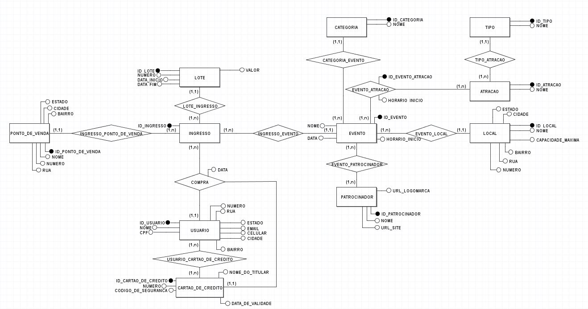
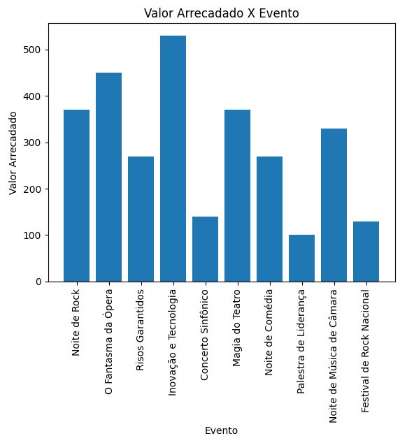
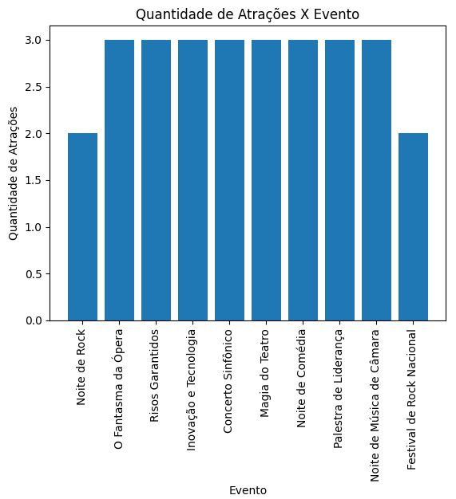
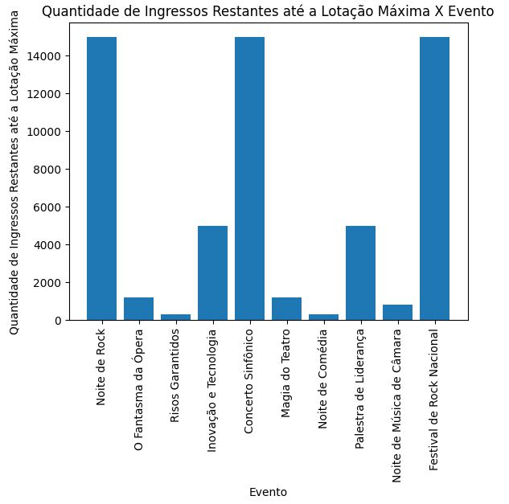

<div align="right">
  🇺🇸 <strong>English</strong> | 🇧🇷 <a href="README.pt-br.md">Português</a>
</div>

<br>

# 🎟️ Ticket Management Platform

Project developed for the **Database I (DEC7129)** course at the **Federal University of Santa Catarina, Araranguá campus**.

**Semester:** 2024/1 <br>
**Authors:** Lucas Porto and Nikolas Lopes <br>
**Professor:** Dr. Alexandre Leopoldo Gonçalves

---

## 📌 About the project

Database system for a ticket sales platform. The main objective is to provide a structure where users can browse and purchase tickets for a wide variety of events while viewing detailed information about each one.

The project was developed in **Python**, using the `mysql-connector-python` connector to communicate with a **MySQL** database. It covers the database's complete lifecycle, including table creation (DDL), test data insertion, update and delete operations, and queries.

---

## ⚙️ Features / Business rules

* **Users:** each user has an email, name, CPF (unique Brazilian taxpayer identification number), phone number, and complete address (state, neighborhood, city, street, and number).
* **Ticket purchases:** tickets can be purchased through the website or at a physical point of sale (partner store), with its own registered address.
* **Events and categories:** each event has a name, date, start time, and belongs to a category (Concert, Theater, Stand-up Comedy, Lecture, or Musical Performance).
* **Attractions:** an event can have multiple attractions (singer, band, musician, lecturer, etc.), classified by type, and the same attraction can participate in multiple events.
* **Ticket batches:** tickets are sold in batches, each with a start date, end date, and price. The higher the batch number, the more expensive the ticket.
* **Event venues:** each event takes place at a venue with a maximum capacity, and a venue can host multiple events.
* **Sponsors:** events can have multiple sponsors, with a logo and website, and a sponsor can support multiple events.
* **Credit cards:** each user can have multiple registered credit cards, which can be used when purchasing tickets.

---

## 🗃️ Database modeling

### Conceptual Model

<p align="center">
  
</p>

### Logical Model

<p align="center">
  
</p>

### Database entities

The `src/main.py` script creates the following tables:

| Table                       | Description                                                           |
| --------------------------- | --------------------------------------------------------------------- |
| `USUARIO`                   | Platform user information                                             |
| `CARTAO_DE_CREDITO`         | Registered credit cards                                               |
| `USUARIO_CARTAO_DE_CREDITO` | N:N relationship between users and credit cards                       |
| `PONTO_DE_VENDA`            | Physical partner stores that sell tickets                             |
| `LOCAL`                     | Venues where events take place                                        |
| `CATEGORIA`                 | Event category (Concert, Theater, etc.)                               |
| `TIPO`                      | Attraction type (Singer, Band, Lecturer, etc.)                        |
| `ATRACAO`                   | Attractions participating in events                                   |
| `EVENTO`                    | Registered events                                                     |
| `EVENTO_ATRACAO`            | N:N relationship between events and attractions                       |
| `PATROCINADOR`              | Event sponsors                                                        |
| `EVENTO_PATROCINADOR`       | N:N relationship between events and sponsors                          |
| `LOTE`                      | Ticket sales batches, including price and period                      |
| `INGRESSO`                  | Available tickets, associated with an event, batch, and point of sale |
| `COMPRA`                    | Record of a ticket purchase made by a user using a credit card        |

All tables use foreign keys to ensure referential integrity between related entities.

---

## 🛠️ Technologies

* **Python 3**
* **MySQL** — relational database management system
* **mysql-connector-python** — Python ↔ MySQL connection library

---

## ▶️ How to run

### Requirements

* Python 3 installed;
* A locally running MySQL server;
* The `mysql-connector-python` library.

Install the library with:

```bash
pip install mysql-connector-python
```

### Configuration

The `src/main.py` file contains the `connect_resgatocao()` function, which establishes the database connection:

```python
def connect_resgatocao():
    cnx = mysql.connector.connect(
        host='localhost',
        database='modelo',
        user='root',
        password='123'
    )
```

Before running the program, create an empty database in MySQL using the same name specified in `database=`. By default:

```sql
CREATE DATABASE modelo;
```

Adjust `host`, `database`, `user`, and `password` according to your environment if necessary.

### Running the application

From the repository root, run:

```bash
python src/main.py
```

The program will display an interactive terminal menu:

```text
---MENU---
1.  CRUD RESGATOCAO
2.  TEST - Create all tables
3.  TEST - Insert all values
4.  TEST - Update
5.  TEST - Delete
6.  CONSULTA 01
7.  CONSULTA 02
8.  CONSULTA 03
9.  CONSULTA EXTRA
10. Show Table
11. Update Value
12. CLEAR ALL RESGATOCAO
0.  Disconnect DB
```

### Menu options

| Option | Action                                                                                                                                                                                    |
| ------ | ----------------------------------------------------------------------------------------------------------------------------------------------------------------------------------------- |
| 1      | Runs the complete workflow: drops the tables, recreates them, inserts test data, runs the 4 queries ("before"), performs test updates and deletes, and runs the 4 queries again ("after") |
| 2      | Creates all database tables (DDL)                                                                                                                                                         |
| 3      | Inserts test data into all tables                                                                                                                                                         |
| 4      | Performs test updates on selected tables                                                                                                                                                  |
| 5      | Performs test deletes on selected tables                                                                                                                                                  |
| 6      | Runs Query 1                                                                                                                                                                              |
| 7      | Runs Query 2                                                                                                                                                                              |
| 8      | Runs Query 3                                                                                                                                                                              |
| 9      | Runs the Extra Query                                                                                                                                                                      |
| 10     | Allows the user to select a table by name and display all of its records                                                                                                                  |
| 11     | Allows the user to manually update a value in any table                                                                                                                                   |
| 12     | Drops all database tables                                                                                                                                                                 |
| 0      | Closes the database connection and exits the program                                                                                                                                      |

---

## 🔎 Queries

### Query 1 — Total revenue per event

Displays the total amount collected from ticket sales, grouped by event.

```sql
SELECT
        EVENTO.id_evento,
        EVENTO.nome,
        sum(valor)
FROM
        EVENTO,
        INGRESSO,
        LOTE,
        COMPRA
WHERE
        EVENTO.id_evento = INGRESSO.id_evento AND
        INGRESSO.id_ingresso = COMPRA.id_ingresso AND
        INGRESSO.id_lote = LOTE.id_lote
GROUP BY
        EVENTO.id_evento
ORDER BY
        EVENTO.id_evento;
```

<p align="center">
  
</p>

---

### Query 2 — Number of attractions per event

Displays the number of attractions associated with each event.

```sql
SELECT
    EVENTO.id_evento,
    EVENTO.nome,
    count(*)
FROM
    EVENTO,
    EVENTO_ATRACAO,
    ATRACAO
WHERE
    EVENTO.id_evento = EVENTO_ATRACAO.id_evento AND
    ATRACAO.id_atracao = EVENTO_ATRACAO.id_atracao
GROUP BY
    EVENTO.id_evento
ORDER BY
    EVENTO.id_evento;
```

<p align="center">
  
</p>

---

### Query 3 — Remaining tickets until maximum capacity

Displays the number of tickets that can still be sold before reaching the maximum capacity of the venue for each event.

```sql
SELECT
    EVENTO.id_evento,
    EVENTO.nome,
    LOCAL.capacidade_maxima - count(*)
FROM
    EVENTO,
    INGRESSO,
    COMPRA,
    LOCAL
WHERE
    EVENTO.id_evento = INGRESSO.id_evento AND
    INGRESSO.id_ingresso = COMPRA.id_ingresso AND
    EVENTO.id_local = LOCAL.id_local
GROUP BY
    EVENTO.id_evento, EVENTO.nome
ORDER BY
    EVENTO.id_evento;
```

<p align="center">
  
</p>

---

### Extra Query — User purchase ranking

Additional query that displays a ranking of users based on the number of purchases they have made.

```sql
SELECT
    USUARIO.id_usuario,
    USUARIO.nome,
    count(*)
FROM
    USUARIO,
    COMPRA
WHERE
    USUARIO.id_usuario = COMPRA.id_usuario
GROUP BY
    USUARIO.id_usuario, USUARIO.nome
ORDER BY
    count(*) DESC;
```

---

## 📁 Repository structure

The current project structure is organized as follows:

```text
ticket-management-database/
│
├── docs/
│   └── report.pdf
│
├── images/
│   ├── conceptual_model.jpg
│   ├── logical_model.jpg
│   ├── query_1.jpg
│   ├── query_2.jpg
│   └── query_3.jpg
│
├── src/
│   └── main.py
│
└── README.md
```

### `src/main.py`

Main application script. It contains:

* database connection;
* table creation (DDL);
* test data insertion;
* update and delete operations;
* SQL queries;
* interactive menu;
* CRUD operations.

### `images/`

Directory containing the images used in the project documentation:

* `conceptual_model.jpg` — conceptual database model;
* `logical_model.jpg` — logical database model;
* `query_1.jpg` — Query 1 result;
* `query_2.jpg` — Query 2 result;
* `query_3.jpg` — Query 3 result.

### `docs/report.pdf`

Complete report developed for the Database I course.

---

## 📄 Project documents

* 📄 **[Report](docs/report.pdf)**
**Database I (DEC7129) — 2024/1**
